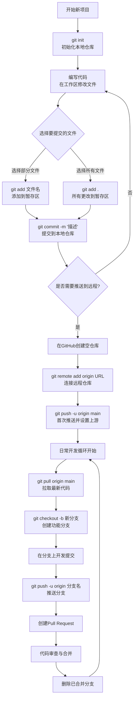
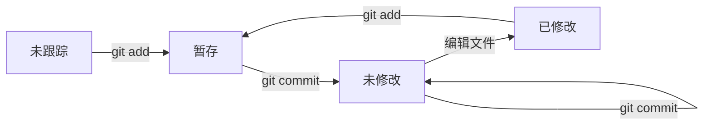
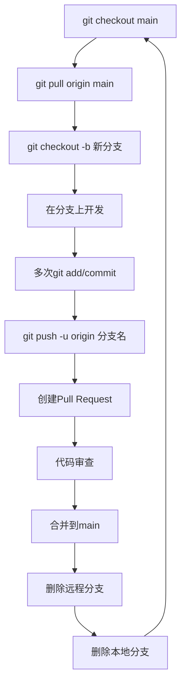
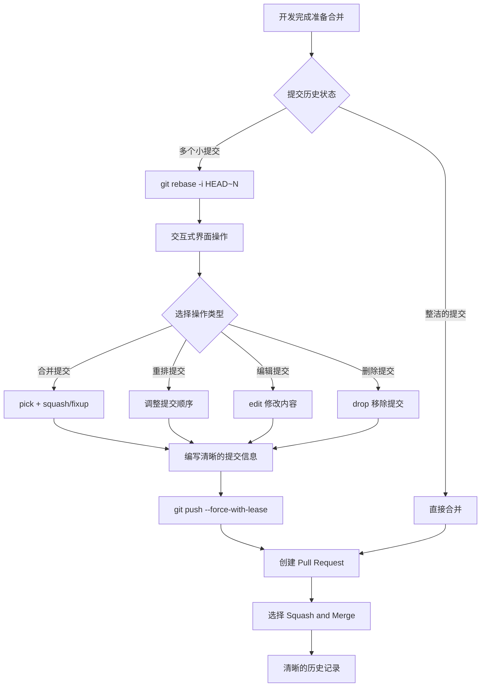
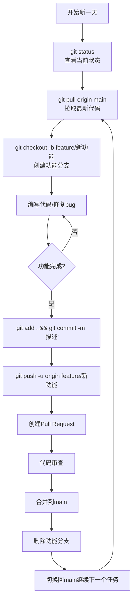

# Git 操作流程图与完整指南

> 本文详细介绍了 Git 的完整工作流程，从基础操作到高级技巧，包含丰富的流程图和实用命令。

## 📋 Git 工作流程总览



## 🔧 Git 基础操作

### 1. 安装与配置

```bash
# 配置用户信息
git config --global user.name "你的姓名"
git config --global user.email "你的邮箱@example.com"

# 查看配置
git config --list
```

### 2. 仓库初始化与状态管理

```bash
# 初始化新仓库
git init

# 查看当前仓库状态
git status

# 查看文件差异
git diff
```

### 3. 文件状态生命周期



### 4. 基础操作命令

```bash
# 添加文件到暂存区
git add <filename>
git add *              # 添加所有文件

# 提交更改
git commit -m "提交描述"
git commit -a -m "描述"  # 提交所有已修改文件

# 重置文件
git restore <filename>           # 恢复工作区文件
git restore --staged <filename>  # 取消暂存状态

# 删除文件
git rm <filename>      # 删除文件
git rm <filename> -f   # 强制删除

# 移动/重命名文件
git mv from to
```

## 🌿 分支管理

### 分支工作流程



### 分支操作命令

```bash
# 查看分支
git branch           # 查看本地分支
git branch -r        # 查看远程分支
git branch -a        # 查看所有分支

# 创建和切换分支
git branch <branch-name>          # 创建分支
git switch <branch-name>          # 切换分支
git switch -c <branch-name>       # 创建并切换分支
git checkout -b <branch-name>     # 创建并切换分支（旧语法）

# 删除分支
git branch -d <branch-name>       # 删除本地分支
git branch -D <branch-name>       # 强制删除本地分支
git push origin --delete <branch-name>  # 删除远程分支

# 合并分支
git merge <branch-name>           # 合并分支
```

## 🔄 变基（Rebase）

### 变基工作流程



### 变基命令

```bash
# 交互式变基
git rebase -i HEAD~3        # 整理最近3次提交
git rebase -i <commit-hash> # 整理到指定提交

# 变基操作类型
# pick: 使用提交
# reword: 使用提交但修改提交信息
# edit: 使用提交但停止修改
# squash: 合并到前一个提交
# fixup: 合并到前一个提交并丢弃提交信息
# drop: 删除提交

# 分支变基
git rebase main feature-branch  # 将特性分支变基到main
```

## ☁️ 远程仓库操作

### 远程仓库配置

```bash
# 添加远程仓库
git remote add origin https://github.com/username/repo.git
git remote add gitee https://gitee.com/username/repo.git

# 查看远程仓库
git remote -v

# 删除远程仓库
git remote remove origin

# 重命名远程仓库
git remote rename old-name new-name
```

### 推送与拉取

```bash
# 首次推送
git push -u origin main

# 常规推送
git push origin main
git push origin feature-branch

# 拉取代码
git pull origin main                    # 拉取并自动合并
git fetch origin                       # 只下载不合并
git fetch --prune                      # 同步远程分支状态

# 克隆仓库
git clone https://github.com/username/repo.git
git clone https://github.com/username/repo.git my-folder  # 指定目录
```

## 🏷️ 标签管理

### 标签操作

```bash
# 查看标签
git tag

# 创建标签
git tag v1.0.0                    # 轻量标签
git tag -a v1.0.0 -m "版本描述"    # 附注标签
git tag v1.0.0 <commit-hash>      # 为历史提交打标签

# 推送标签
git push origin v1.0.0            # 推送单个标签
git push origin --tags            # 推送所有标签

# 删除标签
git tag -d v1.0.0                 # 删除本地标签
git push origin --delete v1.0.0   # 删除远程标签

# 检出标签
git checkout v1.0.0
```

## 📁 .gitignore 配置

### 常用忽略规则

```gitignore
# 依赖目录
node_modules/
vendor/
packages/*/vendor/

# 构建输出
dist/
build/
*.tar.gz
*.zip

# 环境文件
.env
.env.local
.env.production

# 日志文件
*.log
logs/

# 系统文件
.DS_Store
Thumbs.db

# IDE 文件
.vscode/
.idea/
*.swp
*.swo

# 临时文件
*.tmp
*.temp
```

### 创建 .gitignore

```bash
# 创建 .gitignore 文件
touch .gitignore

# 添加忽略规则后提交
git add .gitignore
git commit -m "chore: 添加gitignore配置"
```

## 🎯 日常开发工作流

### 标准开发流程



### 实用命令合集

```bash
# 查看提交历史
git log --oneline          # 简洁历史
git log --graph           # 图形化历史
git log --stat            # 显示文件变更统计

# 撤销操作
git commit --amend        # 修改上次提交信息
git reset HEAD~1          # 撤销上次提交，保留更改
git reset --hard HEAD~1   # 彻底撤销上次提交

# 储藏更改
git stash                 # 储藏当前更改
git stash list            # 查看储藏列表
git stash apply           # 应用最新储藏
git stash pop             # 应用并删除储藏

# 比较差异
git diff                  # 工作区与暂存区差异
git diff --staged         # 暂存区与仓库差异
git diff HEAD             # 工作区与最新提交差异
```

## 🚨 故障排除与最佳实践

### 常见问题解决

```bash
# 1. 推送冲突
git pull --rebase origin main
# 解决冲突后
git add .
git rebase --continue
git push

# 2. 误删文件恢复
git checkout HEAD -- filename

# 3. 恢复误删分支
git reflog
git checkout -b branch-name commit-hash

# 4. 分离头指针恢复
git switch -c new-branch-name
```

### Git 配置优化

```bash
# 设置自动清理远程分支
git config --global fetch.prune true

# 设置默认编辑器
git config --global core.editor "code --wait"

# 设置推送方式
git config --global push.default simple

# 设置别名
git config --global alias.co checkout
git config --global alias.br branch
git config --global alias.ci commit
git config --global alias.st status
```

## 📊 提交信息规范

### 提交类型

| 类型       | 说明                   | 示例                         |
| ---------- | ---------------------- | ---------------------------- |
| `feat`     | 新功能                 | `feat: 添加用户登录功能`     |
| `fix`      | 修复bug               | `fix: 修复登录页面样式问题`  |
| `docs`     | 文档更新               | `docs: 更新API文档`         |
| `style`    | 代码格式调整           | `style: 调整代码缩进`       |
| `refactor` | 代码重构               | `refactor: 重构用户服务类`  |
| `test`     | 测试相关               | `test: 添加用户登录测试`    |
| `chore`    | 构建过程或辅助工具变动 | `chore: 更新webpack配置`    |

### 提交信息模板

```
<type>: <subject>

<body>

<footer>
```

## 🎉 快速参考表

| 场景 | 命令 | 说明 |
|------|------|------|
| **初始化** | `git init` | 初始化新仓库 |
| **克隆** | `git clone URL` | 克隆远程仓库 |
| **状态** | `git status` | 查看工作区状态 |
| **添加** | `git add 文件` | 添加文件到暂存区 |
| **提交** | `git commit -m "消息"` | 提交到本地仓库 |
| **推送** | `git push` | 推送到远程仓库 |
| **拉取** | `git pull` | 拉取远程更新 |
| **分支** | `git checkout -b 分支名` | 创建并切换分支 |
| **合并** | `git merge 分支名` | 合并分支 |
| **标签** | `git tag v1.0.0` | 创建版本标签 |

---