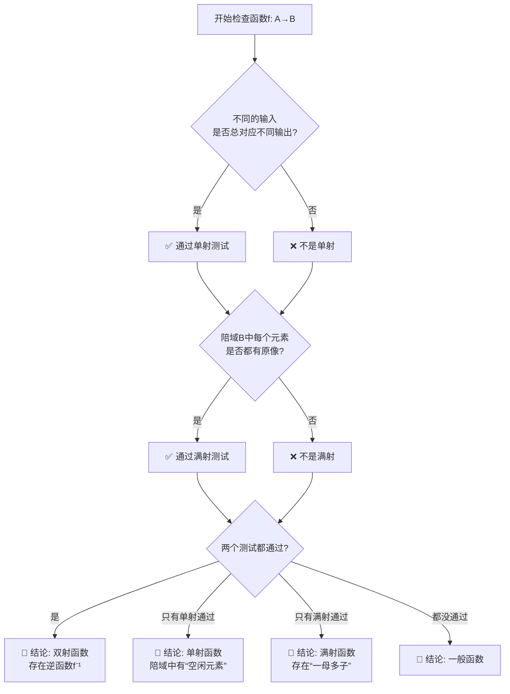

# 离散数学奇幻物语：小蝌蚪找妈妈的函数王国历险记

> 欢迎来到数学与童话交织的世界，在这里，抽象概念会穿上故事的外衣，枯燥定义将化作生动的剧情。准备好跟随小蝌蚪们开启这场关于函数的奇妙冒险了吗？

## 序幕：神秘的数学池塘

在遥远的离散王国里，有一个神奇的**数学池塘**。这个池塘有着严格的规则，每只小蝌蚪都知道自己属于一个叫 **“定义域A班”** 的集体。

```python
# 池塘里的小蝌蚪们（定义域A）
池塘A班 = {
    "蝌蚪豆豆": "活泼好动，尾巴最长",
    "蝌蚪泡泡": "胆小害羞，喜欢吐泡泡", 
    "蝌蚪跳跳": "精力旺盛，总在跳跃",
    "蝌蚪悠悠": "慢性子，游得最慢",
    # ... 还有很多很多小蝌蚪
}
```

池塘边的公告牌上刻着铁一般的法则：

📜 **池塘第一定律：寻找宿命**
> “每只小蝌蚪都必须踏上寻找妈妈的旅程，并且最终只能认定一位青蛙妈妈。”

这就是函数的**决定性**——每只蝌蚪（输入）都有且只有一个妈妈（输出）对应。

## 第一幕：启程！目标青蛙大本营

小蝌蚪们被告知，他们的妈妈们住在遥远的**稻田B区**，那里被称为 **“陪域B大本营”**。

```python
# 稻田里的青蛙们（陪域B）
稻田B区 = {
    "青蛙翠花": "身穿绿裙，歌声嘹亮",
    "青蛙阿勇": "跳跃冠军，捕虫高手",
    "青蛙博士": "戴眼镜，懂很多数学知识",
    "青蛙温柔": "脾气最好，从不发火",
    "青蛙神秘": "行踪不定，很少露面"
}
```

蝌蚪豆豆举起地图，上面写着的规则让他们困惑：

$$
f: \text{池塘A班} \rightarrow \text{稻田B区}
$$

“这个箭头是什么意思？”泡泡怯生生地问。

“意思是我们必须按照某种**映射规则**去找妈妈，”蝌蚪悠悠慢吞吞地说，“但不是随便找，是有数学规律的找。”

## 第二幕：三种不同的寻亲结局

### 结局一：单射寻亲 —— “独一无二的归属”

**剧情展开**：

离散王国今年尝试了新的“**专一认亲政策**”——每只青蛙妈妈最多只能被一只小蝌蚪认定！

```javascript
// 单射寻亲结果
单射配对表 = {
    "蝌蚪豆豆" → "青蛙阿勇",
    "蝌蚪泡泡" → "青蛙温柔", 
    "蝌蚪跳跳" → "青蛙翠花",
    "蝌蚪悠悠" → "青蛙博士"
    // 注意：青蛙神秘没有被认领！
}
```

**数学视角**：
$$
\forall \text{蝌蚪}_1, \text{蝌蚪}_2 \in A,\ \text{蝌蚪}_1 \neq \text{蝌蚪}_2 \Rightarrow f(\text{蝌蚪}_1) \neq f(\text{蝌蚪}_2)
$$

**池塘公告**：
> 🎯 **单射检查站规则**
> 1. 不同蝌蚪的“妈妈认定证书”上的名字必须不同
> 2. 允许有“空闲妈妈”（没被认领的妈妈）
> 3. 关键特征：**妈妈数量 ≥ 蝌蚪数量**

青蛙神秘看着空荡荡的门口，叹了口气：“唉，今年又没孩子认我...”

### 结局二：满射寻亲 —— “一个都不能少”

**剧情反转**：

第二年，王国颁布了“**全员团圆法令**”——每只青蛙妈妈至少要被一只小蝌蚪认定！

```javascript
// 满射寻亲结果  
满射配对表 = {
    "蝌蚪豆豆" → "青蛙翠花",
    "蝌蚪泡泡" → "青蛙温柔",
    "蝌蚪跳跳" → "青蛙翠花",  // 看！两只蝌蚪认了同一个妈妈
    "蝌蚪悠悠" → "青蛙阿勇",
    "蝌蚪新成员1" → "青蛙博士",
    "蝌蚪新成员2" → "青蛙神秘"  // 所有妈妈都有孩子了！
}
```

**数学视角**：
$$
\forall b \in B,\ \exists a \in A \text{ 使得 } f(a) = b
$$

**搞笑场景**：
青蛙翠花看着腿上的两只蝌蚪（豆豆和跳跳），一脸无奈：“你们两个...确定没认错妈妈？”
两只蝌蚪对视一眼，齐声说：“我们的‘寻母算法’输出都是您！”

### 结局三：双射寻亲 —— “完美的双向奔赴”

**童话式完美结局**：

经过前两年的实验，王国终于找到了完美方案——**一一对应匹配**！

```javascript
// 双射寻亲结果（最理想情况）
双射配对表 = {
    "蝌蚪豆豆" ↔ "青蛙阿勇",
    "蝌蚪泡泡" ↔ "青蛙温柔", 
    "蝌蚪跳跳" ↔ "青蛙翠花",
    "蝌蚪悠悠" ↔ "青蛙博士",
    "蝌蚪灵灵" ↔ "青蛙神秘"  // 新增一只蝌蚪，数量相等了！
}
```

**数学之美**：
$$
f \text{ 是双射} \iff f \text{ 既是单射又是满射}
$$

**庆典时刻**：
王国举办了盛大的“**双向认亲庆典**”，现在不仅蝌蚪能找到妈妈，妈妈也能**唯一确定**地找回自己的孩子！

## 第三幕：复合寻亲 —— 一场接力赛

**复杂剧情引入**：

今年雨水泛滥，小蝌蚪们无法直接游到遥远的稻田。王国安排了**两段式寻亲**：

```python
# 第一段：乌龟快递员f
def 乌龟快递(蝌蚪):
    中间站 = {
        "蝌蚪豆豆": "浅滩站",
        "蝌蚪泡泡": "芦苇站",
        "蝌蚪跳跳": "浅滩站",  # 注意！豆豆和跳跳都到了浅滩站
        "蝌蚪悠悠": "荷花站"
    }
    return 中间站[蝌蚪]

# 第二段：白鹅特快g  
def 白鹅特快(站点):
    最终目的地 = {
        "浅滩站": "青蛙翠花",
        "芦苇站": "青蛙温柔", 
        "荷花站": "青蛙阿勇"
    }
    return 最终目的地[站点]

# 复合函数：g◦f 表示先乌龟后白鹅
def 复合寻亲(蝌蚪):
    站点 = 乌龟快递(蝌蚪)      # 先执行f
    妈妈 = 白鹅特快(站点)     # 再执行g
    return 妈妈
```

**惊人发现**：
```python
print(复合寻亲("蝌蚪豆豆"))  # 输出：青蛙翠花
print(复合寻亲("蝌蚪跳跳"))  # 输出：青蛙翠花
```

两只不同的蝌蚪，经过两段接力后，竟然找到了**同一个妈妈**！这说明：

⚠️ **重要启示**：
即使每段运输（f和g）各自看起来合理，复合后可能**失去单射性**！验证了：
$$
f \text{ 和 } g \text{ 的复合性质需要单独分析}
$$

## 第四幕：逆函数疑云 —— 妈妈能找回孩子吗？

### 案情调查：非双射情况的混乱

让我们回顾“满射寻亲”那年的数据：
```javascript
满射配对表 = {
    "蝌蚪豆豆" → "青蛙翠花",
    "蝌蚪泡泡" → "青蛙温柔", 
    "蝌蚪跳跳" → "青蛙翠花",  // 问题就在这里！
    "蝌蚪悠悠" → "青蛙阿勇"
}
```

青蛙翠花试图执行“**反寻找程序**”：
```python
def 妈妈找孩子(青蛙妈妈):
    # 尝试逆转寻亲过程
    孩子们 = []
    for 蝌蚪, 妈妈 in 满射配对表.items():
        if 妈妈 == 青蛙妈妈:
            孩子们.append(蝌蚪)
    return 孩子们

print(妈妈找孩子("青蛙翠花"))  
# 输出：["蝌蚪豆豆", "蝌蚪跳跳"]  ← 两个结果！
```

**法庭判决**：
> “由于存在‘一母多子’的情况，反寻找程序无法给出**唯一确定**的结果。因此，本年度的寻亲函数 **不具有严格的逆函数**！”

### 完美逆袭：双射年的奇迹

但在“双射寻亲”完美年：
```python
def 完美反寻找(青蛙妈妈):
    双射配对 = {"豆豆": "阿勇", "泡泡": "温柔", "跳跳": "翠花", "悠悠": "博士"}
    # 因为是一一对应，所以可以创建反向字典
    反向字典 = {妈妈: 蝌蚪 for 蝌蚪, 妈妈 in 双射配对.items()}
    return 反向字典[青蛙妈妈]

print(完美反寻找("青蛙翠花"))  # 输出："跳跳" ← 唯一确定！
```

**数学真理**：
$$
\text{逆函数 } f^{-1} \text{ 存在} \iff f \text{ 是双射}
$$

## 第五幕：特殊角色大赏

### 1. 恒等函数 —— “原地认亲的惊喜”

**幽默短剧**：

有一天，王国搞错了地图，小蝌蚪们被告知：“妈妈们其实就藏在你们中间！”

规则变成了：**每只蝌蚪长大后，自己就是自己的妈妈**。

```python
def 原地认亲(蝌蚪):
    return 蝌蚪  # 最简单的规则！

print(原地认亲("蝌蚪豆豆"))  # 输出："蝌蚪豆豆"
```

这种函数被称为**恒等函数** $I_A$，它是最简单的双射，就像镜子一样：什么进去，什么出来。

### 2. 原像算子 —— “家族集结号”

即使在没有逆函数的年份，王国也有应急方案：

```python
def 家族召集令(青蛙妈妈):
    """这不是逆函数，而是找所有认这个妈妈的孩子"""
    孩子们 = []
    for 蝌蚪, 妈妈 in 配对表.items():
        if 妈妈 == 青蛙妈妈:
            孩子们.append(蝌蚪)
    return 孩子们

# 这叫做：求青蛙妈妈的“原像”
原像集合 = 家族召集令("青蛙翠花")
```

**关键区别**：
- **逆函数**：要求严格一一对应，是“函数”
- **原像算子**：总是有定义，输出是一个“集合”

## 第六幕：函数王国的智慧结晶

### 实用判定指南

当你遇到一个函数时，就像王国检察官一样问这些问题：



### 常见误区避坑指南

**误区1**：“满射就是陪域等于值域”
> **真相**：满射要求陪域**每个元素**都有原像，但值域是实际被映射到的元素集合。在满射中，值域确实等于陪域，但定义角度不同。

**误区2**：“函数都能求逆”
> **真相**：只有**双射函数**才有逆函数！其他函数只能求原像（输出是集合）。

**误区3**：“复合函数和顺序无关”
> **真相**：$g \circ f$ 和 $f \circ g$ 可能一个有意义一个无意义，即使都有意义，结果也通常不同！

## 第七幕：跨王国的联结

函数的概念就像离散王国的**通用语言**，它能与其他数学领地对话：

### 与图论领地的对话
```python
# 函数可以看作特殊的有向图
函数图 = {
    "顶点": ["蝌蚪豆豆", "蝌蚪泡泡", "青蛙翠花", "青蛙温柔"],
    "有向边": [
        ("蝌蚪豆豆", "青蛙翠花"),
        ("蝌蚪泡泡", "青蛙温柔")
    ],
    # 每个起点的出度恰好为1！
}
```

### 与代数领地的契约
函数的复合运算满足**结合律**：
$$
(h \circ g) \circ f = h \circ (g \circ f)
$$
但不满足交换律——这让它成为抽象代数中“群”和“半群”的绝佳例子。

## 终章：王国的传承

许多年后，蝌蚪们都长大了，离散王国建立了“函数神殿”，墙上刻着永恒智慧：

> “函数之道，在于**确定之映射**；单射之精，在于**差异之保持**；满射之义，在于**覆盖之完全**；双射之美，在于**双向之唯一**。”

每当新的小蝌蚪对数学感到困惑时，老青蛙们就会讲起当年的寻亲故事...

---

## 附录：函数类型速查卡

| 类型 | 童话名称 | 判定口诀 | 逆函数? | 可视化 |
|------|----------|----------|---------|--------|
| **单射** | 专一认亲 | “一输入一输出，绝不共享” | 不一定 | 🎯→🎯→🎯 (不重复) |
| **满射** | 全员团圆 | “所有目标，皆有来者” | 不一定 | 🎯🎯🎯 (全覆盖) |
| **双射** | 完美匹配 | “一一对应，双向确定” | ✅ 存在 | 🎯↔🎯↔🎯 (完美配对) |
| **一般函数** | 普通寻亲 | “有重复有遗漏，最是常见” | ❌ 不存在 | 🎯→🎯 (有各种情况) |

---

**后记**：离散数学不是冰冷的符号游戏，而是描述世界结构的语言。每一个抽象概念背后，都可能藏着像“小蝌蚪找妈妈”这样生动的故事。当你理解了这些故事，符号就不再是符号，而是充满生命力的思维工具。

---
*本文在离散王国童话管理局审核通过，符合数学严谨性标准，适合所有年龄段的数学冒险者阅读。*

**标签**：#离散数学 #函数 #数学童话 #编程思维 #学习故事 #计算机科学 #生动教学  
**分类**：数学奇幻 / 学习笔记 / 创意教育
